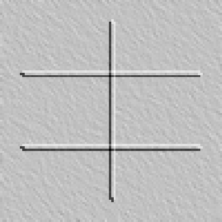

# Detection Results

This directory summarises line-detection outputs for each tile. Images below are thumbnails of generated hillshades.

| Tile | Candidates |
|------|-----------|
| TAL01L0002C0002 | 1 |
| TAL01L0001C0003 | 1 |
| TAL01L0002C0004 | pending |
| TAL01L0003C0003 | pending |

Embedded PNGs can be found under each `outputs/{tile}` directory.

Example hillshade for `TAL01L0002C0002`:

